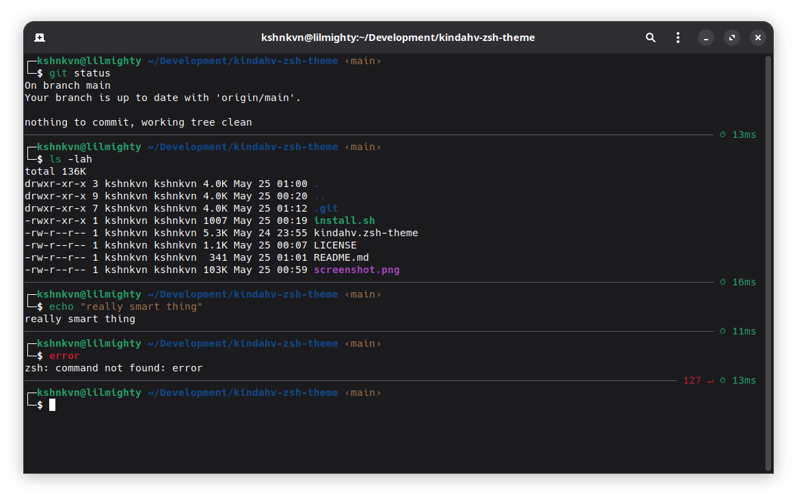
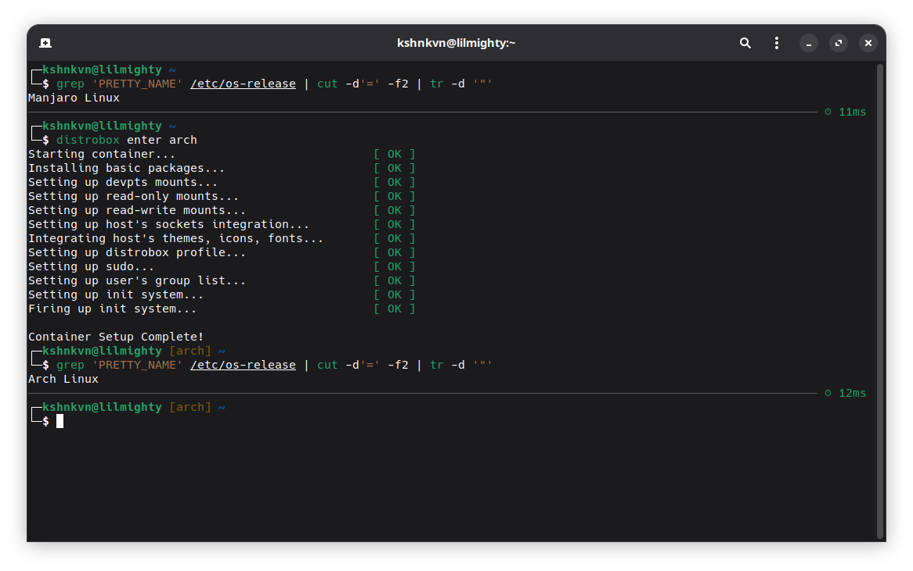

# kindahv.zsh-theme

A clean zsh theme with command execution time tracking.



Inside a container:



## Install

```bash
./install.sh
```

Add to `~/.zshrc`:
```bash
ZSH_THEME="kindahv"
```

## Features

- Command execution time display
- Git/Hg branch info
- Virtual environment support
- Error code display
- Clean two-line prompt
- Print $CONTAINER_ID if set (e.g. in Distrobox)
